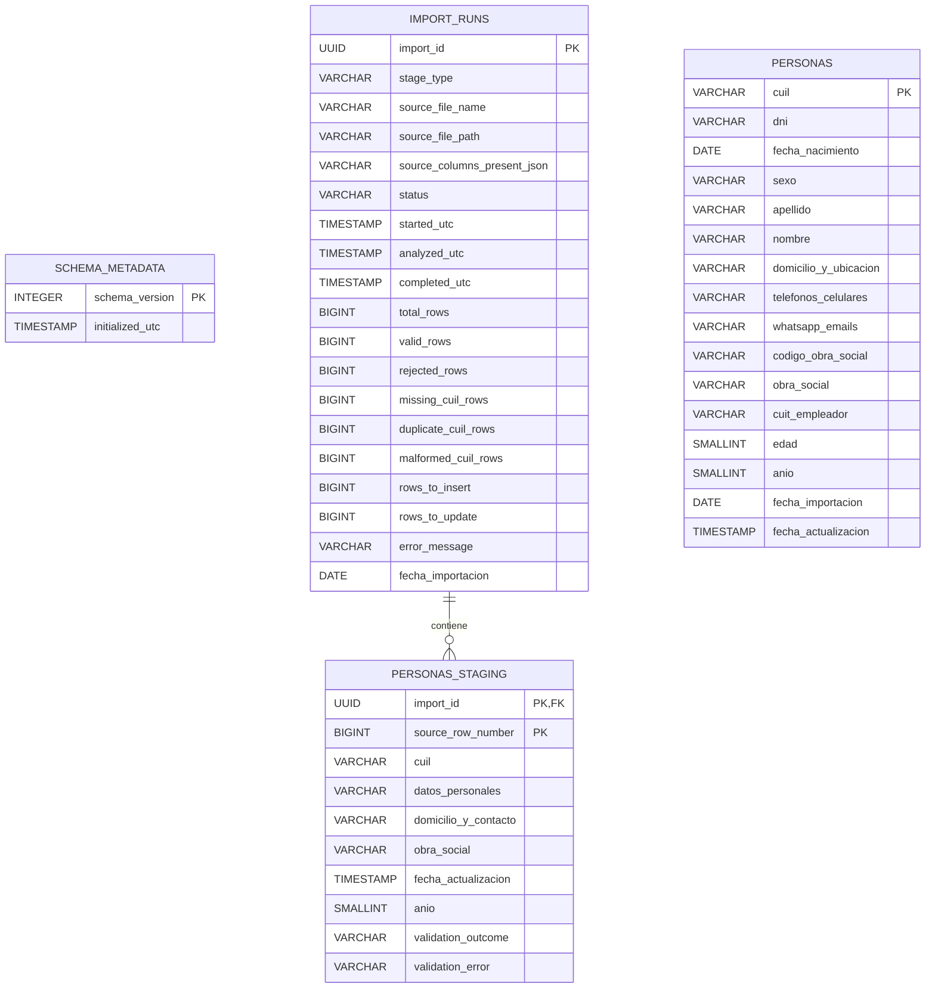

# PapaPersonas — Diagrama de tablas y flujo de trabajo

Este documento explica cómo se guarda la información, para qué sirve cada tabla y cómo avanzará un archivo desde su recepción hasta la exportación para un call center.

> **Estado actual:** tablas/relaciones/migraciones implementadas. Paso 1, Proceso 2 (Analyze + Confirm Apply), Proceso 3 V1 (consulta guiada + export CSV) y Proceso 4 V1 (stock + extracciones) operativos en UI WPF por pestañas.

## Estructura UI WPF actual

- Ventana principal con `TabControl` superior:
  1. Preparar datos de Hernán
  2. Actualizar base de Sergio
  3. Consultar datos (habilitado, V1 guiada)
  4. Stock y extracciones (habilitado, V1 guiada)
- Cada proceso habilitado tiene:
  - formulario principal en área con scroll independiente,
  - consola de actividad propia debajo,
  - `GridSplitter` para redimensionar altura de consola.
- Estado de consola:
  - vive solo mientras la app está abierta,
  - se preserva al cambiar de pestaña,
  - se limpia por nueva ejecución del proceso correspondiente.

La aplicación tiene 4 procesos principales:

| Proceso | Rol | ¿Actualiza `personas`? |
|---|---|---|
| Proceso de datos de Hernán | Limpieza/preparación: aísla duplicados, valida sólo el mínimo requerido, columnas extra son aviso no bloqueante, prepara columnas para el pedido a Sergio. | No. |
| Actualización de base de Sergio | Persistencia controlada: lista columnas desconocidas y permite Continuar/Cancelar; bloquea errores estructurales, carga reconocidos en staging y actualiza la base definitiva. | Sí. |
| Consulta de datos guardados de Sergio | Filtra los datos ya guardados y exporta CSV para call centers. | No (sólo lectura). |
| Stock y extracciones | Genera stock operativo por fecha, exporta CSV y ejecuta extracciones con recuperación de pendiente por token. | Sí (tablas de stock). |

## Vista rápida

```text
 Archivo de Hernán
        |
        v
  IMPORT_RUNS  1 -------- N  PERSONAS_STAGING
  (la operación)            (datos temporales)
                                 |
                                 | validar
                                 | - CUIL vacío
                                 | - CUIL duplicado
                                 | - CUIL malformado
                                 v
                    +------------+-------------+
                    |                          |
                    v                          v
            Archivo de rechazados      Archivo para Sergio
                                               |
                                               v
                                      Devolución de Sergio
                                               |
                                               v
                                      PERSONAS_STAGING
                                               |
                                      revisar y confirmar
                                               |
                                               v
                                          PERSONAS
                                      (base definitiva)
                                               |
                                 filtrar + elegir columnas
                                               |
                                               v
                                      CSV para call center
```

La tabla `SCHEMA_METADATA` trabaja por separado: controla qué versión de la estructura tiene la base y qué migraciones ya fueron aplicadas.

## Diagrama de tablas



`PERSONAS_STAGING` y `PERSONAS` poseen las columnas individuales completas. En el diagrama se agruparon algunos campos únicamente para que sea legible.

## Responsabilidad de cada tabla

### 1. `schema_metadata`

Controla la versión técnica de la base.

| Campo | Uso |
|---|---|
| `schema_version` | Número de migración aplicada. |
| `initialized_utc` | Momento en que se registró esa versión. |

Cuando agreguemos una tabla o columna, no recrearemos la base: agregaremos una migración nueva. La versión sólo avanza si toda la migración termina correctamente.

### 2. `import_runs`

Representa una ejecución de importación, no una persona.

Ejemplos:

- Una carga del archivo de Hernán.
- Una devolución recibida de Sergio.

Guarda:

- qué archivo se procesó;
- qué columnas estuvieron presentes exactamente en ese archivo (`source_columns_present_json`);
- qué etapa del flujo representa;
- cuándo comenzó y terminó;
- estado de la operación;
- cantidad total, válida, rechazada, nueva y actualizada;
- error general, si ocurrió.

Estados previstos:

```text
pending
   -> analyzing
   -> ready_for_confirmation
   -> applying
   -> completed

Cualquier etapa puede terminar en failed.
```

### 3. `personas_staging`

Es la zona temporal y segura de trabajo.

La información entra primero acá, NUNCA directamente a `personas`.

Su clave es:

```text
(import_id, source_row_number)
```

Esto significa que cada fila se reconoce por:

- la importación a la que pertenece;
- el número de fila que tenía en el archivo.

El CUIL puede quedar vacío en staging porque justamente necesitamos conservar esa fila para marcarla como rechazada.

Resultados de validación:

| Valor | Significado |
|---|---|
| `pending` | Todavía no fue validada. |
| `valid` | Puede continuar. |
| `rejected` | No puede aplicarse; tendrá un motivo. |

`validation_error` explicará causas como:

- CUIL vacío;
- CUIL malformado;
- CUIL duplicado dentro del archivo;
- dato incompatible con el esquema esperado.

### 4. `personas`

Es la base definitiva y actual.

Reglas centrales:

- `cuil` es la clave primaria.
- Sólo puede existir una persona por CUIL.
- Si el CUIL no existe, se inserta.
- Si ya existe, aplica contrato por columna:
  - columna ausente en el archivo importado => preservar valor;
  - columna presente con valor no vacío => reemplazar valor;
  - columna presente vacía => limpiar valor.
- No se conserva histórico en la V1.
- Cada registro tiene una sola `fecha_actualizacion`, que se actualiza cuando una importación aplica esa fila.

Los identificadores se guardan como texto, aunque parezcan números:

- CUIL;
- DNI;
- CUIT del empleador;
- código postal;
- códigos de obra social;
- teléfonos y celulares.

Esto evita perder ceros iniciales o formatos especiales.

También se incluye `anio` (`SMALLINT`) en `personas` y `personas_staging` para cubrir la unión canónica de columnas observadas.

## Unión canónica observada y contrato de presencia

- Workbook 0 (template): **36** columnas, incluye `ANIO`.
- Workbook 3 (muestra real de devolución): **28** columnas.
- Decisión vigente: `personas`/`personas_staging` reflejan la unión más amplia conocida y `import_runs.source_columns_present_json` conserva la presencia exacta de columnas por importación para soportar el merge futuro.

### Política de evolución de esquema ante columnas nuevas

> Estado: implementado en lectura de archivo, UI y staging.

- Columna opcional **conocida** ausente en un archivo => no es un error, se preserva el valor existente (contrato por columna, ver arriba).
- Columna **desconocida/nueva** en el **archivo de Hernán** => aviso **no bloqueante** (notice). Esta etapa nunca escribe en `personas`, así que puede continuar advirtiendo.
- Columna **desconocida/nueva** en la **devolución de Sergio** => se lista en orden de origen y el operador puede **Continuar** para ignorarla o **Cancelar** antes de crear estado de importación. Nunca se crea automáticamente.
- CUIL faltante, encabezados duplicados y aliases que colisionan en el mismo campo canónico siguen bloqueando sin opción de Continuar.
- Las columnas desconocidas no entran en staging, `source_columns_present_json`, Apply SQL, `personas` ni el esquema DuckDB.

## Relaciones importantes

### `import_runs` → `personas_staging`

Relación uno a muchos:

```text
Una importación contiene muchas filas temporales.
Cada fila temporal pertenece a una importación existente.
```

La base impide crear filas temporales huérfanas mediante una clave foránea.

### ¿Por qué staging no apunta a `personas`?

Porque una fila temporal puede:

- no tener CUIL;
- tener un CUIL inválido;
- estar duplicada;
- ser rechazada y nunca convertirse en una persona definitiva.

La relación con `personas` ocurre durante la aplicación del lote, usando el CUIL válido.

### ¿Por qué `personas` no guarda `import_id`?

Porque en la V1 no guardamos histórico. `personas` representa únicamente el último estado conocido. `import_runs` mantiene el resumen operativo de las cargas, no versiones anteriores de cada persona.

## Flujo completo paso a paso

### Etapa A — Proceso de datos de Hernán

1. El usuario selecciona el archivo.
2. El programa valida columnas mínimas para preparar el pedido a Sergio:
   - `CUIL`, `CUIL_APENOM`, `CUIL_CODOS`, `CUIL_DESCRIPOS`, `CUIL_FECHANAC`, `CUIL_EDAD`.
   Columnas adicionales de Hernán no bloquean esta etapa preparatoria.
3. Crea un registro en `import_runs` con etapa `hernan_raw`.
4. Carga las filas en `personas_staging`.
5. Valida CUIL y estructura.
6. Detecta todos los CUIL repetidos dentro del lote.
7. Marca como rechazadas las filas inválidas o duplicadas.
8. Muestra un resumen antes de continuar.
9. Genera un archivo de rechazados para revisión.
10. Genera el archivo reducido que se enviará a Sergio.

En esta etapa todavía no se modifica `personas`.

Objetivo de Etapa A:

- limpieza/preparación para generar el archivo de pedido a Sergio;
- no es la fuente final de persistencia.

### Etapa B — Actualización de base de Sergio

1. El usuario selecciona el archivo enriquecido.
2. El programa valida sus columnas. Si hay desconocidas y no hay errores estructurales, las lista y pide Continuar o Cancelar antes de abrir DuckDB.
3. Con Continuar, crea un `import_runs` con etapa `sergio_return` y procesa sólo columnas reconocidas.
4. Carga todas las filas en `personas_staging`.
5. Valida CUIL vacíos, malformados y duplicados.
6. Calcula cuántos registros serán nuevos y cuántos serán reemplazados.
7. Muestra el resumen.
8. Advierte que conviene hacer un backup.
9. El padre decide si crea el backup o continúa.
10. Al confirmar, aplicará solamente las filas válidas sobre `personas` (merge por columna implementado).
11. Actualiza los conteos y el estado de `import_runs`.
12. Genera el archivo de rechazados si corresponde.

Semántica de fechas en Etapa B:

- `fecha_importacion` representa la fecha efectiva del archivo Sergio (capturada en Analyze y persistida por run).
- `fecha_actualizacion` representa cuándo se ejecutó Apply en la base.
- Analyze ownership queda atado a `(path del archivo + fecha_importacion)`.
- Si cambia path o fecha luego de Analyze, Apply se invalida y exige nuevo Analyze.

### Etapa C — Consulta de datos guardados de Sergio

1. El usuario elige filtros.
2. Puede usar CUIL exacto, filtros AND por columnas permitidas y rango de `fecha_importacion`.
3. El programa consulta únicamente `personas`, con preview paginado (no carga completa en memoria).
4. Muestra total filtrado, filas de página y KPI de última `fecha_importacion` en el resultado.
5. El usuario elige qué columnas incluir.
6. El programa exporta CSV en streaming con cancelación y limpieza de archivos parciales.

Límite de alcance V1:

- No hay editor SQL libre ni builder avanzado.
- Para consultas complejas fuera de V1, fallback aprobado: DBeaver en modo lectura.

### Etapa D — Backup manual

1. El usuario presiona `Crear backup`.
2. La aplicación advierte que DBeaver y toda herramienta externa DuckDB deben estar cerrados y solicita confirmación.
3. El programa comprueba que no haya una importación escribiendo.
4. DuckDB consolida los datos pendientes mediante checkpoint/cierre controlado y acceso exclusivo.
5. Se crea una copia fechada únicamente del archivo DuckDB.
6. El usuario elige el destino, por ejemplo una carpeta de Dropbox.
7. Si no se obtiene exclusividad, la operación se cancela con un mensaje para reintentar; nunca se fuerza el cierre de otra herramienta.

### Etapa D2 — Restauración total

1. El usuario selecciona una copia DuckDB.
2. La aplicación advierte sobre DBeaver y solicita confirmación explícita de que se reemplazará TODO el snapshot operativo: personas, importaciones, stock, ventas y extracciones.
3. Se copia y valida el origen en staging antes de bootstrap; se rechazan archivos vacíos, arbitrarios, no reconocidos y de versiones futuras.
4. Se crea un resguardo automático de la base activa y se reemplaza sólo al final.
5. La copia original seleccionada nunca se modifica.
6. Luego del restore se refrescan Procesos 2, 3 y 4; si el snapshot restaurado contiene una extracción pendiente, se muestra inmediatamente el diálogo existente de **Reintentar** o **Cancelar**. Los CSV externos no forman parte del backup. Reset refresca sin abrir ese diálogo.

La base activa permanece siempre fuera de Dropbox.

### Etapa E — Stock y extracciones

Tab Proceso 4 opera sobre tablas de stock (`stock_headers`, `stock_members`) derivadas de `personas`:

1. Seleccionar fecha (`fecha_importacion`) entre las últimas 5 fechas disponibles.
2. Generar stock o regenerar stock actual.
3. Visualizar estado, métricas y resumen por grupo de obra social.
4. Exportar CSV de resumen o CSV completo.
5. Ingresar cantidades por grupo y ejecutar extracción.
6. Si quedó pendiente, resolver por token con Retry o Cancel.
7. Reexportar extracciones completadas del stock vigente.

Reglas clave de Etapa E:

- Regenerar stock es destructivo sobre stock vigente:
  - borra miembros del stock anterior,
  - limpia pendiente,
  - no conserva historial operativo previo en ese stock.
- Base madre `personas` no se elimina.
- Extracción multi-grupo requiere disponibilidad por grupo y finaliza en modo todo-o-nada (sin confirmación de venta parcial).
- Reexportación sólo aplica a tokens vendidos del stock actual.
- Si se trabaja con fecha vieja, el stock puede quedar reducido o marcado desactualizado respecto al último import exitoso.
- Salidas de Proceso 4: sólo CSV UTF-8 con BOM, delimitador coma.

## Qué está implementado hoy

- [x] Apertura y creación de la base DuckDB local.
- [x] Migraciones versionadas y transaccionales.
- [x] Tabla `schema_metadata`.
- [x] Tabla `personas`.
- [x] Tabla `import_runs`.
- [x] Tabla `personas_staging`.
- [x] Campo `anio` en tablas canónicas y staging.
- [x] Metadato `source_columns_present_json` en `import_runs`.
- [x] Campo `fecha_importacion` en `personas` e `import_runs` (migración v4).
- [x] Backfill legado idempotente de `fecha_importacion='2026-08-10'` para cohorte histórica conocida.
- [x] CUIL único en la base definitiva.
- [x] Relación importación → staging.
- [x] Índices iniciales para obra social, código postal y edad.
- [x] Pruebas de creación, migración, rollback e integridad.
- [x] Validador de encabezados por etapa en `PapaPersonas.Core` (mínimos de Hernán con avisos no bloqueantes; desconocidas de Sergio con Continuar/Cancelar y bloqueos estructurales).
- [x] Validador estructural de CUIL (11 dígitos ASCII normalizado) en `PapaPersonas.Core`.
- [x] Clasificador de duplicados de lote por CUIL normalizado (rechaza todos los repetidos).
- [x] Paso 1 implementado sin UI: lectura XLSX de Hernán + CSV para Sergio + CSV de rechazados.

## Qué sigue

- [x] Paso 1 conectado a una pantalla WPF con selección de archivo, configuración, carpeta de salida y resumen agregado.
- [x] Cargar masivamente a staging para Proceso 2A (preview).
- [x] Mostrar resumen previo (WPF Proceso 2, agregado y sin PII).
- [x] Aplicar altas y merge por columna en `personas` usando presencia real de columnas (backend Proceso 2B).
- [x] Construir pantalla WPF de Proceso 2 (analyze + confirm apply + resumen agregado).
- [x] Implementar Proceso 3 V1: filtros guiados, preview paginado y exportación CSV streaming con cancelación.
- [x] Implementar Proceso 4 V1: stock por fecha, exportaciones, extracción por grupos, recuperación de pendiente y reexportación en stock actual.
- [x] Backup y restore implementados con acceso exclusivo, resguardo automático y validación de origen; el backup cubre sólo DuckDB y el restore es total.

## Regla mental para entender el diseño

```text
IMPORT_RUNS dice QUÉ operación ocurrió.
PERSONAS_STAGING contiene QUÉ llegó y si es válido.
PERSONAS contiene QUÉ información queda vigente.
SCHEMA_METADATA dice QUÉ versión técnica tiene la base.
```
Etapa B es la fuente de actualización de la base definitiva `personas`.
